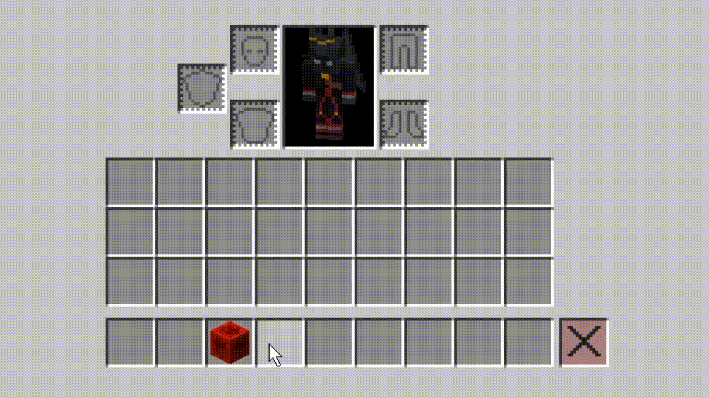
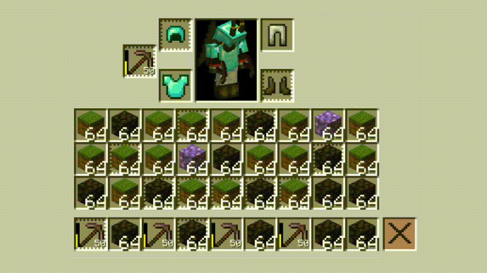

<p>
<center>
<a href="https://modrinth.com/mod/destroy-item-white-list">

</a>
<a href="https://modrinth.com/mod/fabric-api">

</a>
<a href="https://modrinth.com/mod/yacl">

</a>
</center>
</p>
<p><center><a href="https://discord.gg/sBpHZUBebQ">
</a></center></p>

# Destroy Item White List (DIWL)

<p><b>Prevents your selected items from being removed via "Destroy Item"</b></p>

## How to use:
1. Select **slots** with LMB or **items** with RMB, holding < ` > (or < ~ > on your keyboard):

2. Now when you click "Destroy Items" with holding SHIFT, the selected slots remain in place:


## How to customize the locked slot/item texture
add to you texturepack this file:
```properties
assets/diwl/textures/gui/sprites/locked.png
assets/diwl/textures/gui/sprites/locked_item.png
```
by default its 18x18 sprite
